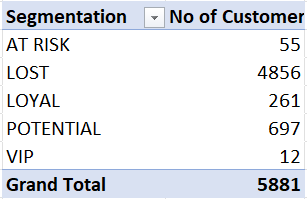

# Erifs-retail-intelligence-system
Enterprise Retail Intelligence and Forecasting System built using Excel for customer segmentation and revenue analysis

## Table of Contents

* [Project Overview](#-project-overview)
* [Problem Statement](#-problem-statement)
* [Key Features](#-key-features)
* [Dashboard Preview](#-dashboard-preview)
* [Key Metrics & KPIs](#-key-metrics--kpis)
* [Dataset Information](#-dataset-information)
* [Workbook Structure](#-workbook-structure)
* [Forecasting Model](#-forecasting-model)
* [RFM & Customer Analysis](#-rfm--customer-analysis)
* [Key Insights & Findings](#-key-insights--findings)
* [Tools & Techniques Used](#️-tools--techniques-used)
* [How to Use](#-how-to-use)
* [Author](#-author)

## Project Overview

The ERIFS (Excel Retail Intelligence & Forecasting System) is a data analytics project built using Microsoft Excel to analyze retail sales data and generate
actionable business insights. The system integrates interactive dashboards, forecasting models, and customer segmentation techniques to help understand sales trends 
and customer behavior. By combining data visualization, pivot tables, and analytical models, the project demonstrates how Excel can be used as a powerful business 
intelligence tool.

## Problem Statement

Retail businesses generate large volumes of transactional data, including customer information, order values, stock codes, and purchase records. Analyzing such large 
datasets can be challenging because they often contain inconsistencies, structural issues, and data quality problems. Without proper analysis, businesses may struggle 
to understand sales patterns, manage inventory efficiently, and identify valuable customer segments.

This project aims to process and analyze retail sales data to extract meaningful business insights. By transforming the raw data, building forecasting models, and 
visualizing key metrics, the system helps support better decision-making and strategic planning for retail operations.

## Key Features

*  **Interactive Excel dashboard for retail sales analysis**
*  **Sales forecasting with scenario-based demand analysis**
* **Customer segmentation using RFM (Recency, Frequency, Monetary) analysis**
*  **Pareto analysis to identify top revenue-generating customers**
*  **KPI tracking including revenue trends, repeat customers, and customer lifetime value**
*  **Pivot table–based reports for revenue, product performance, and customer insights**
*  **Data cleaning and transformation for accurate analysis**
*  **Visualizations to support data-driven business decisions**

## Dashboard Preview

The main dashboard provides an interactive overview of retail sales performance, key KPIs, and customer insights. It allows users to quickly understand revenue trends, customer behavior, and overall business performance.

## Key Metrics & KPIs

The dashboard tracks several important business metrics to evaluate retail performance and customer behavior. These KPIs help measure revenue growth, customer engagement, and overall business health.

**Key metrics included in the analysis:**

 * **Total Revenue** – Overall sales generated during the period
  
 * **Total Customers** – Number of unique customers
  
 * **Repeat Customers** – Customers who made multiple purchases
  
 * **Order Count** – Total number of orders placed
  
 * **Customer Lifetime Value (CLV)** – Estimated revenue generated by each customer

### Revenue Analysis
**Revenue & Profit Trend**

**Revenue By Product**

**Revenue By Country**

### Customer Insights

**Top Customers by Revenue**

**Revenue by Segment**

### Segmentation Metrics

**Customer Segmentation**

**Customer Segmenation Count**

## Dataset Information

The dataset used in this project contains retail transaction records that capture customer purchases, product information, and order details. The data is used to analyze sales performance, customer behavior, and revenue trends.

Key fields included in the dataset:

* **InvoiceNo** – Unique identifier for each transaction
* **StockCode** – Unique code for each product
* **Description** – Product name or description
* **Quantity** – Number of units purchased
* **InvoiceDate** – Date and time of the transaction
* **UnitPrice** – Price per unit of the product
* **CustomerID** – Unique identifier for each customer
* **Country** – Country where the customer is located

The dataset is processed and transformed to remove inconsistencies, handle missing values, and prepare the data for analysis, forecasting, and customer segmentation.

## Workbook Structure

The Excel workbook is organized into multiple sheets, each serving a specific purpose in the data analysis and forecasting workflow.

| Sheet Name            | Description                                                                        |
| --------------------- | ---------------------------------------------------------------------------------- |
| **Dashboard**         | Final interactive dashboard displaying KPIs, revenue trends, and customer insights |
| **FactSales**         | Main fact table containing processed transactional sales data used for analysis    |
| **Revenue Analysis**  | Pivot tables and calculations used to analyze overall revenue trends               |
| **Product Analysis**  | Analysis of product performance and revenue contribution by product                |
| **Customer Analysis** | Customer-level revenue analysis and identification of top customers                |
| **Model Check**       | Validation sheet used to verify forecasting calculations and model outputs         |
| **RFM Analysis**      | Customer segmentation using Recency, Frequency, and Monetary scoring               |

## Forecasting Model

To support future business planning, a forecasting model was developed to estimate upcoming revenue trends based on historical sales data. The model compares actual sales with predicted values and allows scenario-based demand adjustments.

**The forecasting system includes:**

* **Forecast vs Actual Analysis** – Compares predicted revenue with actual historical sales
* **Forecasting Method** – Excel-based forecasting approach used to estimate future demand
* **Demand Scenarios** – Scenario analysis to evaluate how changes in demand affect projected revenue

### Forecast vs Actual

### Forecasting Method

### Demand Scenario Analysis

### Model Evaluation

To measure the accuracy of the forecasting model, **Mean Absolute Percentage Error (MAPE)** was calculated.

The model achieved a **MAPE of 19%**, indicating a reasonable level of forecasting accuracy for retail demand prediction.

MAPE measures the average percentage difference between the actual values and the predicted values. A lower MAPE indicates better forecasting performance.

## RFM & Customer Analysis

To better understand customer behavior, the project applies **RFM (Recency, Frequency, Monetary) analysis**, a widely used customer segmentation technique in retail analytics.

The RFM model evaluates customers based on:

* **Recency (R)** – How recently a customer made a purchase
* **Frequency (F)** – How often a customer makes purchases
* **Monetary (M)** – The total revenue generated by the customer

Using these three metrics, customers are grouped into segments such as high-value customers, loyal customers, and low-engagement customers. This helps businesses identify their most valuable customers and design targeted marketing strategies.

### RFM Customer Analysis

### Revenue by Customer Segment

### Customer Segmentation

### Customer Segment Distribution

## Key Insights & Findings

From the analysis of retail sales data, several important business insights were identified:

###  Revenue Insights

* **Overall revenue shows a positive growth trend** across the analyzed periods (2009–2010 and 2011–2012), 
  indicating the business is in a healthy growth stage.

* **Revenue is heavily concentrated in the United Kingdom**, which accounts for the majority of total sales. 
  This creates a geographic dependency risk for the business.

* **Several countries contribute minimal revenue**, suggesting untapped market potential and a need for 
  targeted expansion or marketing strategies in underperforming regions.

* **A small number of products drive a disproportionately large share of total revenue**, confirming the 
  Pareto principle (80/20 rule) in product performance.

### Customer Insights

* **The majority of customers are single-visit buyers**, meaning they made only one purchase and did not 
  return. This highlights a significant gap in customer retention and engagement.

* **Repeat customers, despite being a smaller group, contribute disproportionately to total revenue**, 
  reinforcing the importance of building customer loyalty and retention programs.

* **RFM analysis reveals that a large segment of customers fall into the "Lost" category**, indicating 
  customers who were once active but have not made recent purchases. This presents a re-engagement 
  opportunity through targeted marketing campaigns.

* **High-value customers identified through RFM scoring represent the most profitable segment**, and 
  protecting these relationships should be a business priority.

### Forecasting Insights

* **The forecasting model achieved approximately 81% accuracy (MAPE of 19%)**, demonstrating a reliable 
  level of demand prediction capability using Excel-based forecasting methods.

* **Scenario-based demand analysis reveals that even a small decrease in demand (–2% to –10%) can have 
  a noticeable impact on projected revenue and profit margins**, emphasizing the need for proactive 
  demand planning.

* **Revenue trends show seasonal patterns**, which can help businesses optimize inventory levels, plan 
  promotions during peak periods, and reduce overstock during low-demand periods.

###  Strategic Recommendations

Based on these findings, the following actions are recommended:

| Area | Recommendation |
|---|---|
| **Customer Retention** | Implement loyalty programs to convert single-visit buyers into repeat customers |
| **Re-engagement** | Design targeted campaigns to win back "Lost" customers identified through RFM analysis |
| **Geographic Expansion** | Develop strategies to grow revenue in underperforming countries beyond the UK |
| **Inventory Planning** | Use seasonal trends and demand forecasts to optimize stock levels |
| **High-Value Customers** | Create personalized experiences and offers for top revenue-generating customers |
| **Demand Monitoring** | Continuously track demand shifts and adjust business strategies using scenario analysis |

These insights can support better decision-making in areas such as marketing strategy, 
inventory management, customer relationship management, and geographic expansion planning.

## Tools & Techniques Used

The project leverages various Excel-based data analysis techniques to transform raw retail data into meaningful business insights.

**Tools**

* Microsoft Excel
* Power Query
* Pivot Tables
* Pivot Charts

**Techniques**

* Data Cleaning and Transformation using Power Query
* Data Modeling using Fact Tables
* KPI Calculation
* Revenue and Product Analysis
* Customer Segmentation using RFM Analysis
* Sales Forecasting
* Scenario-Based Demand Analysis
* Data Visualization through Interactive Dashboards

## How to Use

Follow these steps to explore the project:

1. Download the Excel workbook from this repository.
2. Open the file using **Microsoft Excel (2019 or later recommended)**.
3. Navigate to the **Dashboard** sheet to view the interactive retail analytics dashboard.
4. Use filters and slicers to explore revenue trends, customer segments, and product performance.
5. Review other sheets such as **Revenue Analysis**, **Product Analysis**, and **RFM Analysis** to understand the underlying calculations and models.

##  Author

**Venkat**

Aspiring Data Analyst passionate about data analytics, business intelligence, and forecasting models.

GitHub: https://github.com/venkat-070
